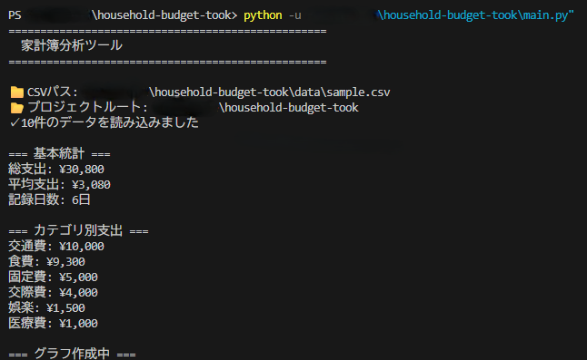
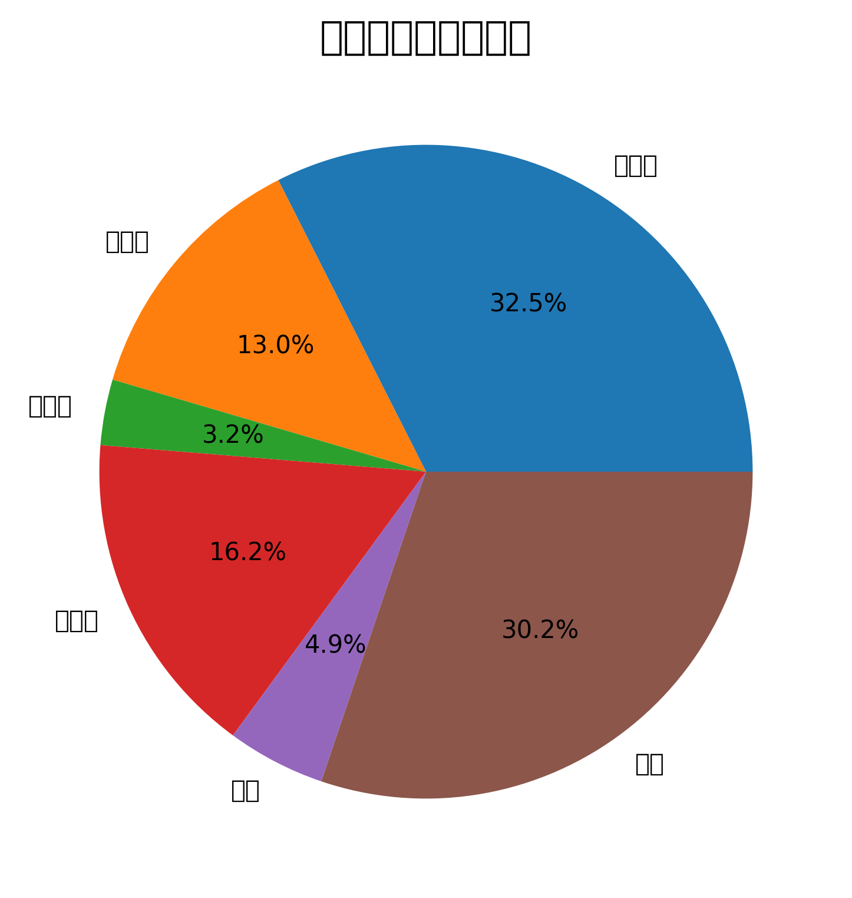
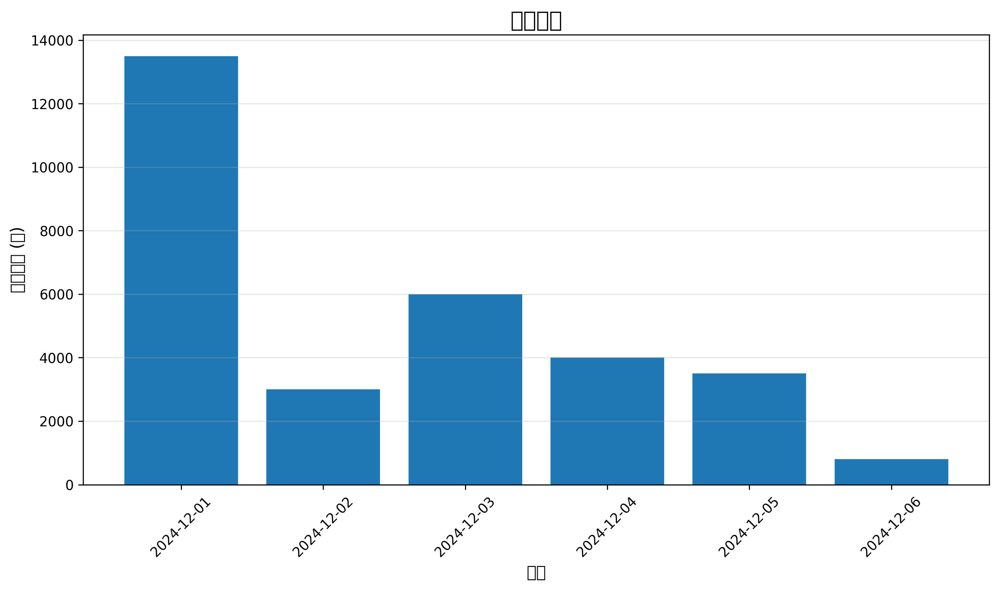

# 家計簿分析ツール 💰

日々の支出を記録・分析し、予算管理をサポートするPythonツール

## 📋 機能

- ✅ CSVファイルからデータ読み込み
- ✅ カテゴリ別支出集計
- ✅ 日別支出の可視化
- ✅ 基本統計情報の表示
- 🚧 使いすぎ警告機能(開発中)
- 🚧 Webアプリ版(予定)

## 🖼️ スクリーンショット

### 実行結果


### カテゴリ別支出(円グラフ)


### 日別支出(棒グラフ)


## 🚀 使い方

### 1. 環境構築
```bash
# リポジトリをクローン
git clone https://github.com/your-username/household-budget-tool.git
cd household-budget-tool

# 必要なライブラリをインストール
pip install -r requirements.txt
```

### 2. データ準備

`data/sample.csv` に支出データを入力:
```csv
日付,カテゴリ,サブカテゴリ,店舗,金額,必需品フラグ,評価,メモ
2024-12-01,食費,自炊,スーパー,3500,1,3,週末の買い出し
2024-12-02,交際費,飲み会,居酒屋,4000,0,2,職場飲み
```

### 3. 実行
```bash
python main.py
```

### 4. 結果確認

- `outputs/graphs/` にグラフが保存されます
- ターミナルに統計情報が表示されます

## 📊 データ形式

| 列名 | 説明 | 例 |
|------|------|-----|
| 日付 | 支出日(YYYY-MM-DD) | 2024-12-01 |
| カテゴリ | 大分類 | 食費、交際費 |
| サブカテゴリ | 小分類 | 自炊、外食 |
| 店舗 | 購入場所 | スーパー、コンビニ |
| 金額 | 支出額(円) | 3500 |
| 必需品フラグ | 必需品=1, 浪費=0 | 1 |
| 評価 | 1-5の5段階 | 3 |
| メモ | 自由記述 | 週末の買い出し |

## 🛠️ 技術スタック

- Python 3.11
- Pandas: データ処理
- Matplotlib: グラフ作成
- Seaborn: グラフ装飾

## 📁 プロジェクト構造
```
household-budget-tool/
├── README.md
├── requirements.txt
├── main.py                 # メインプログラム
├── config.py               # 設定ファイル
├── data/
│   └── sample.csv          # サンプルデータ
├── src/
│   ├── data_loader.py      # データ読み込み
│   ├── analyzer.py         # 分析ロジック
│   └── visualizer.py       # グラフ作成
├── outputs/
│   ├── reports/            # レポート出力先
│   └── graphs/             # グラフ出力先
└── images/                 # README用画像
```

## 🔮 今後の予定

### Phase 2 (予定)
- [ ] 使いすぎ警告機能
- [ ] 月次比較レポート
- [ ] 必需品 vs 浪費の分析

### Phase 3 (予定)
- [ ] Webアプリ化(Streamlit)
- [ ] データベース連携(SQLite)
- [ ] 予算設定機能
- [ ] 機械学習による支出予測

## 👤 作成者

- GitHub: [@garakara](https://github.com/garakara)
- 作成日: 2025年12月

## 📝 ライセンス

MIT License

---

**💡 Tip:** 実際のデータで試す場合は、`data/sample.csv` を編集してください!
